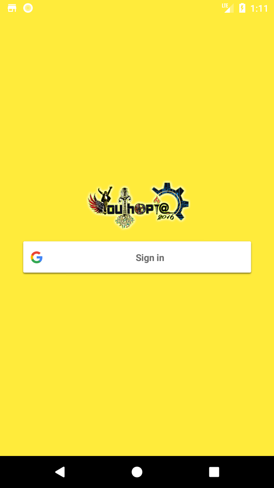
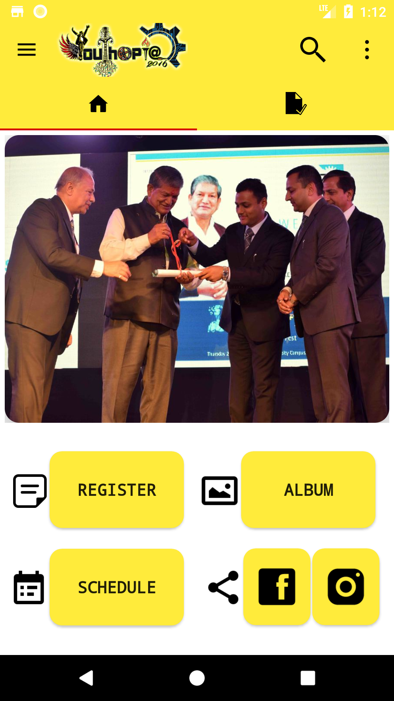
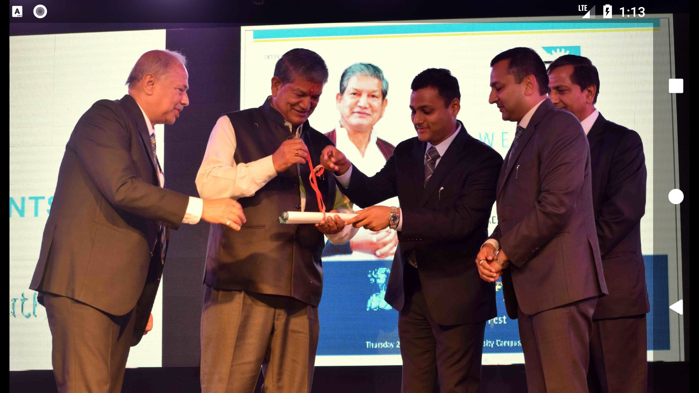
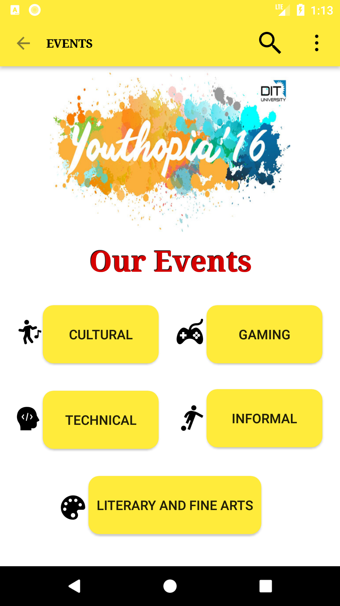
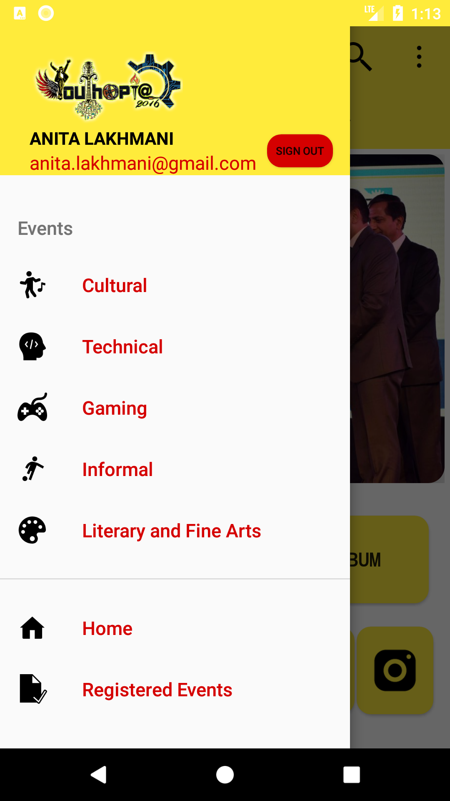
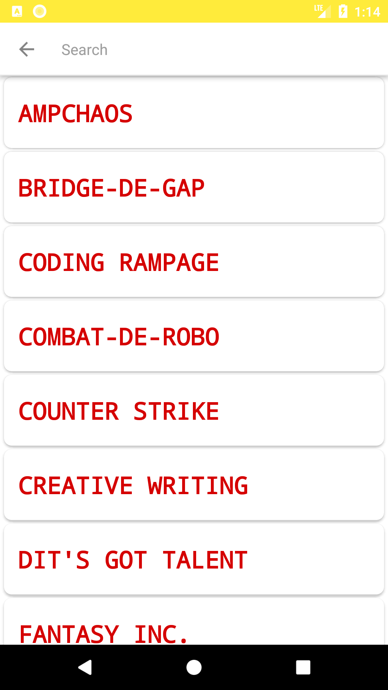
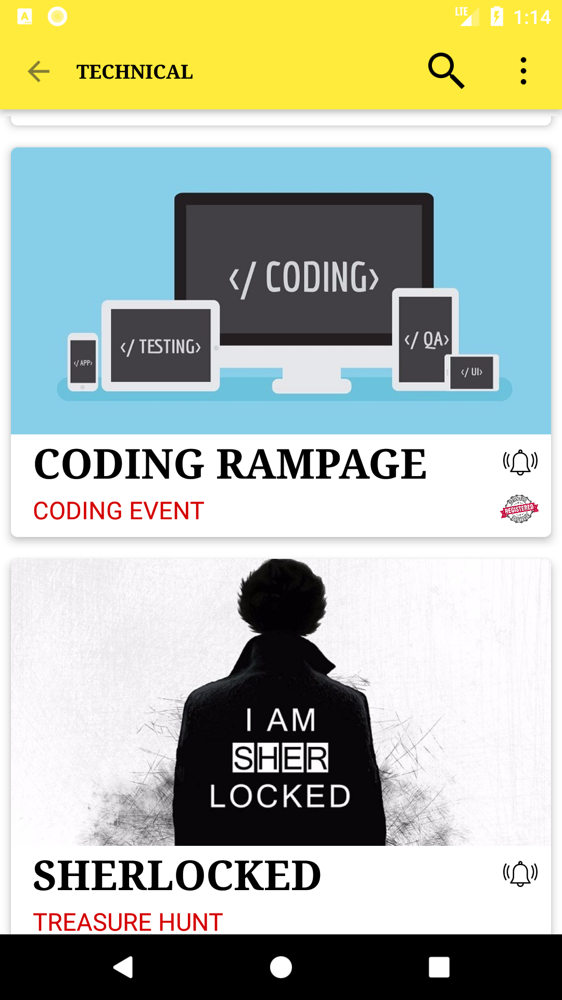
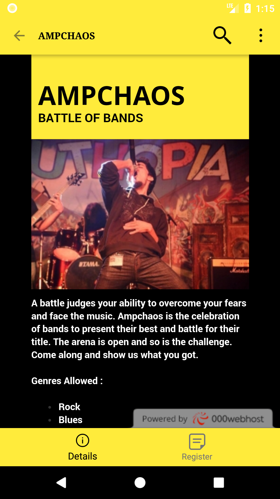
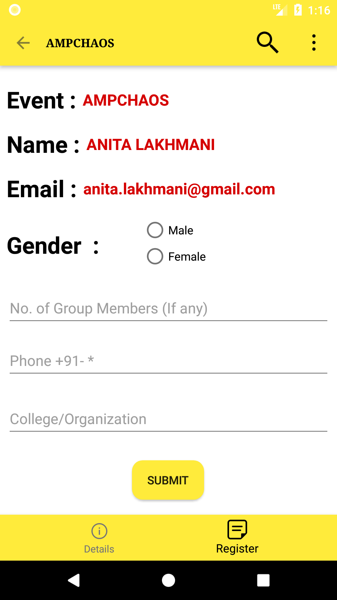

# Youthopia 2k16

<h1>About</h1>

Youthopia 2016 is the annual technical and cultural fest organized by DIT University, Dehradun. Originated with the sole aim of enhancing technical skills and promoting creativity among the students, this knowledge and cultural carnival has encompassed all boundaries to become a worldwide. 

This 3 day technical fest is set to be the most exhilarating experience for students all over the country, laying down excellent opportunities like never before. Around 8,000 students from our university and 2,000 students from other colleges/universities gather every year to behold this extravaganza. 

The events and workshops are meticulously designed to accentuate all genres of talent and reward the meritorious. Combining events and activities spanning various domains namely Battle of Bands, Fashionista, Literary Events, Informals and the Star Nights all under one roof.

<h1>Technologies Used</h1>
<ul>
<li>ANDROID Libraries</li>
<li>JAVA</li>
<li>Google SignIn APIs</li>
<li>Firebase</li>
<li>PHP</li>
<li>MYSQL</li>
</ul>

<h1>Glimpses of DIT SPHERE</h1>
<table>
  <tr>
    <th>  </th>
    <th>  </th>
    <th>  </th>
  </tr>
  <tr>
    <th>  </th>
    <th>  </th>
    <th>  </th>
  </tr>
    <tr>
    <th>  </th>
    <th>  </th>
    <th>  </th>
  </tr>
  </table>
  <b>And Many More..</b>

<h1>Apk of DIT SPHERE</h1>
<a href = "https://raw.githubusercontent.com/ashishlkhmn48/DIT_SPHERE/master/images/sphere.apk">Click to Download</a>
 
Use your Google Account.

<h1>Backend Files of DIT SPHERE for Reference</h1>
https://github.com/ashishlkhmn48/Youthopia_Files

<h1>References</h1>
  <ul>
  <li>https://firebase.google.com/docs/android/setup</li>
  <li>https://developers.google.com/identity/sign-in/web/sign-in</li>
  <li>https://developer.android.com/reference/org/w3c/dom/Document.html</li>
  <li>https://www.w3schools.com</li>
  <li>https://stackoverflow.com</li>
</ul>

<h1>Highlights :</h1>
1. Clean Material UI
2. Event Registration for DIT University's Annual Cultural Fest.
3. Google Sign In
4. Push Notification Mechanism
5. Picture Gallery

Payment Gateway for Registrations Coming Soon.
